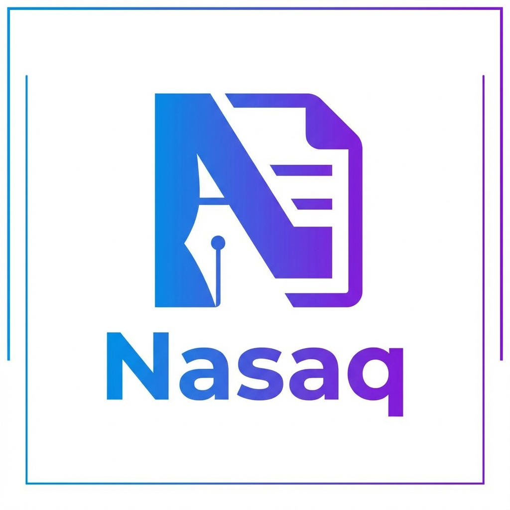

<div align="center">
  
  <h1>Nasaq | نـسـق</h1>
  <p><b>محرر Markdown متطور يمنح نصوصك النظام والجمال</b></p>
  <p>
    <a href="https://AhmedSadd.github.io/Nasaq/">المعاينة المباشرة (Live Demo)</a> •
    <a href="#-المميزات">المميزات</a> •
    <a href="#-الخصوصية">الخصوصية</a> •
    <a href="#-التطوير">التطوير</a>
  </p>
</div>

---

## 🌟 عن نـسـق
**نسق (Nasaq)** هو محرر نصوص Markdown احترافي مصمم ليوفر تجربة كتابة غامرة وسلسة. يجمع "نسق" بين بساطة الأداء وفخامة التصميم، مع التركيز التام على خصوصية المستخدم من خلال التعامل المباشر مع ملفات النظام بدون وسيط.

---

## ✨ المميزات الرئيسية

### 1. تجربة كتابة احترافية (Premium Editor) ✍️
- **تظليل برمجي ذكي**: دعم كامل لكافة لغات البرمجة مع محرك CodeMirror 6 المستقر.
- **وضع التركيز (Zen Mode)**: واجهة نظيفة تماماً تخفي كافة المشتتات لتركز فقط على كلماتك.
- **تنسيقات سريعة**: دعم كامل لاختصارات لوحة المفاتيح (`Bold`, `Italic`, `Links`, `Code Blocks`).

### 2. معاينة تفاعلية حية (Interactive Preview) 👁️
- **المهام الحية (Live Tasks)**: قوائم المهام `[ ]` قابلة للنقر مباشرة في المعاينة لتعديل كود الماركداون فوراً.
- **تنبيهات GitHub**: دعم التنبيهات اللونية الاحترافية (`[!NOTE]`, `[!TIP]`, `[!IMPORTANT]`, `[!WARNING]`, `[!CAUTION]`).
- **رسوم Mermaid البيانية**: ارسم المخططات البرمجية والتدفقية مباشرة داخل ملفاتك.
- **مزامنة التمرير**: تمرير ذكي وثنائي الاتجاه بين المحرر والمعاينة.

### 3. خصوصية وسرعة (Local-First Architecture) 🛡️
- **الوصول المباشر للملفات**: استخدام Native File System API لحفظ وتعديل ملفاتك على جهازك مباشرة.
- **لا وجود للسيرفرات**: نصوصك لا تترك جهازك أبداً، مما يضمن خصوصية 100%.

### 4. تطبيق لكل المنصات (PWA Support) 📱
- يمكنك تثبيت "نسق" كتطبيق مستقل على سطح المكتب أو الهاتف وتصفحه بدون إنترنت تماماً.

---

## ⌨️ اختصارات لوحة المفاتيح

| الاختصار | الوظيفة |
| :--- | :--- |
| `Ctrl + B` | نص عريض (Bold) |
| `Ctrl + I` | نص مائل (Italic) |
| `Ctrl + K` | إدراج رابط (Link) |
| `Ctrl + E` | كود سطري (Inline Code) |
| `Ctrl + Alt + C` | كتلة كود (Code Block) |
| `Ctrl + S` | حفظ التغييرات (Save) |
| `Ctrl + F` | البحث والاستبدال (Search) |

---

## 🛡️ الخصوصية والصور المحلية
في "نسق"، لضمان عرض الصور المحلية بنجاح، يرجى **فتح المجلد (Open Folder)** الذي يحتوي على مشروعك بدلاً من فتح ملف واحد. هذا يمنح المتصفح صلاحية الوصول الآمن للصور والموارد المرتبطة لتظهر بشكل صحيح في المعاينة.

---

## 🚀 التشغيل والتطوير (للتقنيين)

إذا كنت ترغب في تشغيل نسخة التطوير أو بناء مشروعك الخاص:

```bash
# 1. تثبيت الاعتمادات
npm install

# 2. تشغيل وضع التطوير (Local Dev)
npm run dev

# 3. بناء نسخة الإنتاج
npm run build
```

---

## 🛠️ التقنيات المستخدمة
- **Frontend**: React 18, Vite, TypeScript.
- **Styling**: Tailwind CSS, Lucide Icons.
- **Editor Core**: CodeMirror 6.
- **State Management**: Zustand.
- **Markdown Logic**: Unified, Remark, Rehype.

---

<div align="center">
  صُنع بشغف ليكون رفيقك الأول في الكتابة. ✨
</div>
