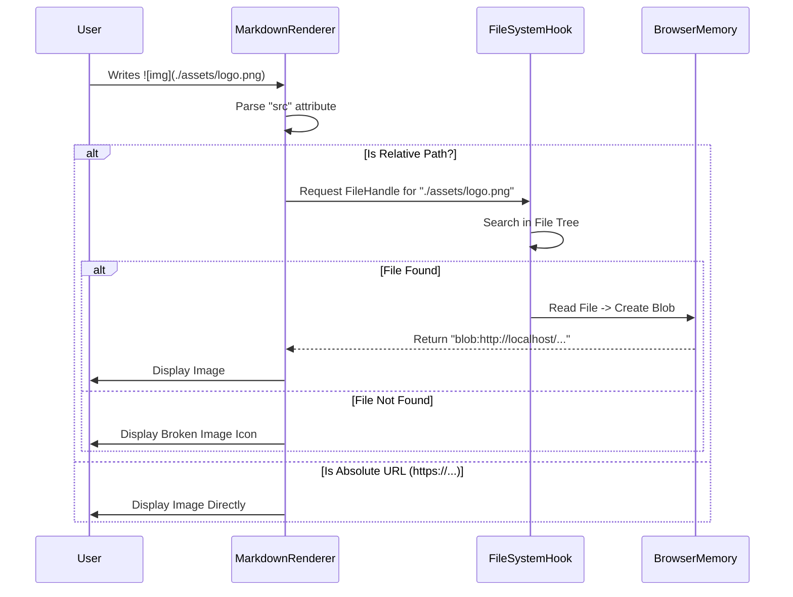

# 📄 Workflows & Use Cases Specification (WUCS)
## Project: Nasaq (نسق)
**Version:** 1.2 (Total Control & Media Update)
**Document ID:** 03_WUCS
**Date:** Jan 2026

---

### 1. 🎯 الغرض من الوثيقة (Document Purpose)
تصف هذه الوثيقة التفاعلات الدقيقة بين المستخدم والنظام. تهدف إلى توضيح "كيفية الاستخدام" للمطورين والمصممين، مع التركيز على السيناريوهات الجديدة: التحكم في اتجاه النص، وإدارة الصور المحلية، وحماية البيانات.

---

### 2. 🔄 مخططات تدفق العمليات (Process Workflows)

#### 2.1 تدفق التحكم في اتجاه النص (Direction Control Workflow)
يصف هذا التدفق ما يحدث عندما يغير المستخدم وضع الاتجاه (Auto/RTL/LTR).

**المنطق التشغيلي:**
1.  **المحفز (Trigger):** المستخدم يضغط زر "Direction Toggle" أو الاختصار `Alt + Shift + D`.
2.  **النظام (Update State):**
    *   يقوم `Zustand` بتحديث قيمة `directionMode`.
    *   يتم حفظ القيمة الجديدة في `localStorage`.
3.  **المحرر (CodeMirror Reaction):**
    *   يستقبل الـ `Compartment` التحديث.
    *   **إذا كان الوضع الجديد (Forced RTL/LTR):**
        *   يتم إزالة `AutoRTLPlugin` (لإيقاف الفحص).
        *   يتم تطبيق سمة `dir="rtl/ltr"` على حاوية المحرر.
    *   **إذا كان الوضع الجديد (Auto):**
        *   يتم تفعيل `AutoRTLPlugin`.
        *   يقوم المحرر فوراً بإعادة فحص الأسطر المرئية (Re-scan Visible Lines) وتلوينها.
4.  **النتيجة المرئية:** يتغير محاذاة النص فوراً دون وميض أو إعادة تحميل للصفحة.

#### 2.2 تدفق حل الصور المحلية (Local Image Resolution Workflow)
يصف كيف يحول النظام نص مارك داون `` إلى صورة مرئية.

**الرسم التوضيحي للتدفق:**


#### 2.3 تدفق إدارة الملفات (CRUD Workflow)
1.  **إنشاء ملف جديد:**
    *   المستخدم ينقر أيقونة "+".
    *   إدخال الاسم -> النظام يتحقق من عدم التكرار.
    *   النظام يستدعي `getFileHandle(create: true)`.
    *   تحديث الشجرة وفتح الملف الجديد فوراً.
2.  **حذف ملف:**
    *   النقر على "Delete".
    *   **شرط:** إظهار نافذة تأكيد (Dialog: "Are you sure?").
    *   عند الموافقة -> استدعاء `removeEntry` وتحديث الواجهة.

---

### 3. 👤 تفاصيل حالات الاستخدام (Detailed Use Cases)

#### **[UC-01] التحكم في اتجاه النص (Text Direction Control)**
*   **الوصف:** تمكين المستخدم من فرض اتجاه معين للنص أو تركه تلقائياً.
*   **الفاعل:** المطور / الكاتب.
*   **المسار الأساسي (Switching Modes):**
    1.  المستخدم يكتب كوداً إنجليزياً في وضع `Auto`.
    2.  يقرر كتابة تعليق طويل بالعربية، لكن الرموز تظهر بشكل غير مرتب.
    3.  يضغط `Alt + Shift + D` للتبديل إلى `Forced RTL`.
    4.  **النظام:** يجبر كل الفقرات (بما فيها الكود) لليمين.
    5.  يكمل المستخدم الكتابة بارتياح.
    6.  يضغط `Alt + Shift + D` مرتين للعودة لـ `Auto` لرؤية التنسيق النهائي.

#### **[UC-02] عرض الصور المحلية (Local Image Viewing)**
*   **الوصف:** إدراج وعرض الصور المخزنة في نفس مجلد المشروع.
*   **الشروط المسبقة:** المستخدم فتح مجلداً يحتوي على صور.
*   **السيناريو:**
    1.  المستخدم يكتب: ``.
    2.  **النظام (في الخلفية):** يحلل المسار، يبحث عن الملف، ينشئ `Blob URL`.
    3.  **المعاينة:** تظهر الصورة فوراً.
    4.  المستخدم يغير اسم الصورة في الـ Sidebar.
    5.  **النظام:** الصورة في المعاينة "تتكسر" (Broken Link).
    6.  المستخدم يعدل الرابط في المحرر للاسم الجديد -> تظهر الصورة مجدداً.

#### **[UC-03] الحماية من فقدان البيانات (Dirty State Protection)**
*   **الوصف:** منع المستخدم من إغلاق العمل غير المحفوظ.
*   **السيناريو:**
    1.  المستخدم يعدل ملفاً (تظهر علامة `*`).
    2.  يحاول إغلاق تبويب المتصفح (Tab Close).
    3.  **النظام:** يعترض الحدث (`beforeunload`).
    4.  المتصفح يظهر رسالة نظامية: "Changes you made may not be saved."
    5.  المستخدم يضغط "Cancel".
    6.  يعود المستخدم ويضغط `Ctrl+S`.
    7.  تختفي علامة `*`.
    8.  يغلق المتصفح بأمان.

---

### 4. ⚠️ مصفوفة الأخطاء والاستجابة (Error Response Matrix)

| رمز الخطأ | الحالة (Condition) | استجابة النظام (System Behavior) | رسالة المستخدم (User Feedback) |
| :--- | :--- | :--- | :--- |
| **ERR-IMG-01** | صورة غير موجودة (404 Local) | عرض أيقونة صورة مكسورة في المعاينة. | (لا توجد رسالة منبثقة، فقط بصرية) |
| **ERR-DIR-01** | فشل حفظ الإعدادات (Storage Full) | الاستمرار بالعمل بالوضع الافتراضي. | "Could not save preferences." (Toast) |
| **ERR-PERM-01** | فقدان إذن الكتابة عند الحفظ | إظهار نافذة طلب الإذن فوراً. | "Permission required to save changes." |

---

### 5. ⌨️ اختصارات لوحة المفاتيح (Key Bindings)

تم تحديث القائمة لتشمل الاختصارات الجديدة.

| الاختصار (Shortcut) | الوظيفة (Action) | السياق (Context) |
| :--- | :--- | :--- |
| `Alt + Shift + D` | تدوير اتجاه النص (Auto -> RTL -> LTR). | Global |
| `Ctrl + S` | حفظ الملف الحالي. | Global |
| `Ctrl + B` | إظهار/إخفاء الشريط الجانبي. | Global |
| `Ctrl + .` | (اختياري) تفعيل وضع التركيز (Zen Mode). | Global |

---

### 6. 🎨 حالات واجهة المستخدم (UI States)

#### 6.1 حالة تبديل الاتجاه (Direction Toggle State)
*   **Auto:** الأيقونة تظهر حرف (¶) مع سهمين متعاكسين.
*   **RTL:** الأيقونة تظهر فقرة محاذية لليمين (Highlight Active).
*   **LTR:** الأيقونة تظهر فقرة محاذية لليسار.

#### 6.2 حالة الصور (Image States)
*   **Loading:** (نادرة محلياً) تظهر وميض خفيف (Skeleton) مكان الصورة.
*   **Success:** تظهر الصورة بالأبعاد الأصلية (أو `max-width: 100%`).
*   **Error:** يظهر مربع رمادي مع أيقونة صورة مشطوبة واسم الملف (Alt Text).

```