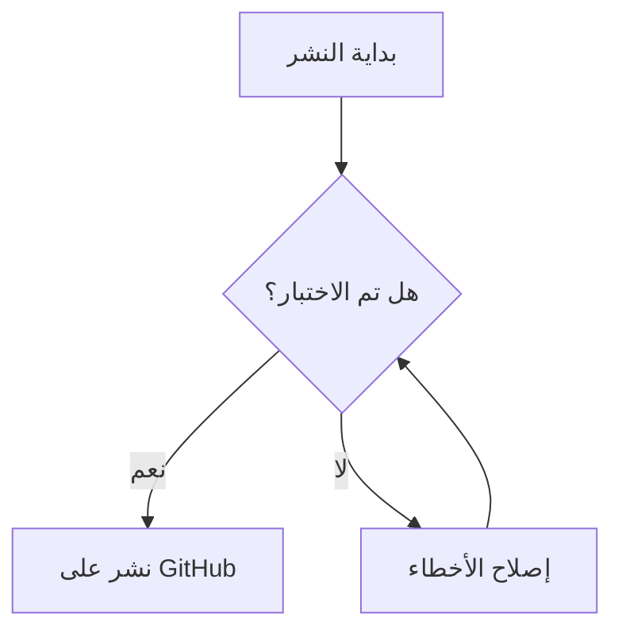

# ملف اختبار ميزات محرّر "نسق" 🚀

هذا الملف مصمم لاختبار كافة الوظائف البرمجية والبصرية في التطبيق.

## 1. التنسيقات السريعة (Keyboard Shortcuts)
- [ ] اضغط `Ctrl + B` لجعل هذا النص **عريض**.
- [x] اضغط `Ctrl + I` لجعل هذا النص *مائل*.
- [ ] اضغط `Ctrl + K` لإضافة رابط.
- [ ] اضغط `Ctrl + E` لكود سطري: `console.log("hello")`.
- [ ] اضغط `Ctrl + Alt + C` لإنشاء كتلة كود:
```javascript
function test() {
  console.log("Nasaq is working!");
}
```


## 2. مربعات الاختيار التفاعلية (Interactive Tasks)
- [x] اختبر النقر هنا (يجب أن يتحول لـ [x] في المحرر).
- [x] اختبر إلغاء النقر هنا (يجب أن يعود لـ [ ] في المحرر).
    - [x] مهمة فرعية 1
    - [ ] همة فرعية 2

## 3. الصور المحلية (Local Images)
> [!NOTE]
> سيتم تشغيل هذه الميزة الآن. لتجربتها، تأكد من وجود صورة باسم `logo.png` في نفس المجلد.


## 4. المخططات (Mermaid Diagrams)


## 5. التنبيهات الاحترافية (GitHub Alerts)
> [!TIP]
> جرب نسخ كود سطري بالضغط عليه لرؤية الوميض البصري الجديد!

> [!WARNING]
> تأكد من حفظ عملك دائماً باستخدام `Ctrl + S`.
